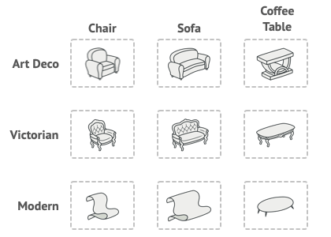
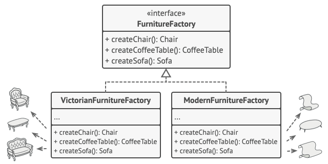

# Abstract Factory

#### **I. Giới thiệu**

**Abstract Factory** là một design pattern cho phép bạn tạo ra các nhóm đối tượng liên quan mà không cần chỉ định các lớp cụ thể của chúng.


#### **II. Vấn đề**

Hãy tưởng tượng rằng bạn đang tạo một trình mô phỏng cửa hàng nội thất. Code của bạn bao gồm các class đại diện cho:

1. Một bộ bàn ghế đầy đủ bao gồm: `Chair`+ `Sofa`+ `CoffeeTable`.
2. Một bộ bàn ghế có thể có rất nhiều phong cách. Ví dụ: bộ bàn ghế bao gồm `Chair`+ `Sofa`+ `CoffeeTable`có sẵn phong các thiết kế sau: `Modern`, `Victorian`, `ArtDeco`.



* Bạn cần có một cách nào đó để tạo ra các đồ vật nội thất riêng lẻ, sao cho chúng phù hợp với các đồ vật khác trong cùng một phong cách. Khách hàng có thể sẽ tức giận khi nhận được đồ nội thất bị lẫn lộn các phong cách thiết kế khác nhau.


Ngoài ra, bạn không muốn thay đổi Code hiện có khi thêm sản phẩm hoặc dòng sản phẩm mới vào chương trình. Các nhà cung cấp đồ nội thất cập nhật danh mục của họ rất thường xuyên và bạn sẽ không muốn thay đổi mã cốt lõi mỗi lần điều đó xảy ra.

#### **II. Giải pháp**

* Điều đầu tiên mà Abstract Factory pattern gợi ý là khai báo rõ ràng các interface cho từng sản phẩm riêng biệt của dòng sản phẩm (ví dụ: ghế, ghế sofa hoặc bàn cà phê). Sau đó, bạn có thể làm cho tất cả các biến thể của sản phẩm tuân theo các interface đó. Ví dụ: tất cả các biến thể ghế đều có thể implement interface `Chair`, tất cả các biến thể của bàn cà phê đều có thể implement interface `CoffeeTable`, v.v.


* Bước tiếp theo là khai báo *Abstract Factory* - một interface với danh sách các phương thức tạo cho tất cả các sản phẩm thuộc họ sản phẩm (ví dụ: `createChair`, `createSofa`và `createCoffeeTable`). Các phương thức này phải trả về các loại sản phẩm **trừu tượng** được biểu thị bằng các giao diện mà chúng ta đã trích xuất trước đó: `Chair`, `Sofa`, `CoffeeTable`v.v.



* Bây giờ, còn các biến thể sản phẩm thì sao? Đối với mỗi biến thể của dòng sản phẩm, chúng tôi tạo một class Factory riêng biệt dựa trên interface `AbstractFactory`. Factory là một class trả về các sản phẩm thuộc một loại cụ thể. Ví dụ: `ModernFurnitureFactory` chỉ có thể tạo `ModernChair`và các đối tượng `ModernSofa`.`ModernCoffeeTable`
* Khách hàng phải tương tác với cả factory và product thông qua abstract interfaces tương ứng của chúng. Điều này cho phép bạn thay đổi loại nhà máy mà bạn nhận từ khách hàng và mẫu mã sản phẩm mà khách hàng nhận được phải đúng như khi truyền vào.


* Giả sử khách hàng muốn có một nhà máy sản xuất ghế. Khách hàng không cần phải biết về loại nhà máy cũng như loại ghế mà họ nhận được. Cho dù đó là mẫu ghế Hiện đại hay ghế kiểu Victoria, khách hàng đều phải xử lý tất cả các ghế theo cách giống nhau bằng cách sử dụng abstract interface `Chair`. Với cách tiếp cận này, điều duy nhất mà khách hàng biết về chiếc ghế là khi thực hiện phương thức `sitOn`. Ngoài ra, bất kỳ mẫu ghế nào được trả về, nó sẽ luôn khớp với loại ghế sofa hoặc bàn cà phê được sản xuất bởi cùng một loại nhà máy.
* Còn một điều nữa cần làm rõ: nếu khách hàng chỉ tiếp xúc với các abstract interface, điều gì tạo ra các factory object? Thông thường, ứng dụng tạo một Factory object cụ thể ở giai đoạn khởi tạo. Từ lúc đầu, ứng dụng phải chọn loại nhà máy tùy thuộc vào cấu hình hoặc cài đặt môi trường.

#### **III. Cấu trúc**


1. **Abstract Products** khai báo interface cho một tập hợp các sản phẩm riêng biệt nhưng có liên quan tạo nên một dòng sản phẩm.
2. **Concrete Products** là các cách triển khai khác nhau của các sản phẩm trừu tượng, được nhóm theo các biến thể. Mỗi sản phẩm trừu tượng (ghế/ghế sofa) phải được triển khai theo tất cả các biến thể nhất định (Victoria/Hiện đại).
3. **Abstract Factory** interface khai báo một tập hợp các phương thức để tạo từng sản phẩm trừu tượng.
4. **Concrete Factories** implement các phương thức của nhà máy trừu tượng. Mỗi concrete factory tương ứng với một biến thể sản phẩm cụ thể và chỉ tạo ra những biến thể sản phẩm đó.
5. Mặc dù các concrete factories khởi tạo các sản phẩm cụ thể nhưng chữ ký của các phương thức tạo của chúng phải trả về các sản phẩm *trừu tượng* tương ứng . Bằng cách này, khách hàng sử dụng nhà máy sẽ không được kết hợp với biến thể cụ thể của sản phẩm mà nó nhận được từ nhà máy. **Khách hàng** có thể làm việc với bất kỳ biến thể sản phẩm/nhà máy cụ thể nào, miễn là nó giao tiếp với các đối tượng của họ thông qua các giao diện trừu tượng.

#### **IV. Mã giả**

* Ví dụ này minh họa cách sử dụng mẫu **Abstract factory** để tạo các phần tử UI đa nền tảng mà không cần ghép client code với các UI class người dùng cụ thể, trong khi vẫn giữ tất cả các phần tử được tạo nhất quán với hệ điều hành đã chọn.


* Các thành phần UI giống nhau trong một ứng dụng đa nền tảng sẽ hoạt động tương tự như nhau nhưng trông hơi khác một chút trong các hệ điều hành khác nhau. Hơn nữa, công việc của bạn là đảm bảo rằng các thành phần UI phù hợp với phong cách của hệ điều hành hiện tại. Bạn sẽ không muốn chương trình của mình hiển thị các điều khiển macOS khi nó được thực thi trong Windows.
* Interface Abstract Factory khai báo một tập hợp các phương thức tạo mà client code có thể sử dụng để tạo ra các loại thành phần UI khác nhau. Các factory sẽ tương ứng với từng hệ điều hành và tạo ra các thành phần UI phù hợp với hệ điều hành đó.
* Nó sẽ hoạt động như thế này: khi một ứng dụng khởi chạy, nó sẽ kiểm tra loại hệ điều hành hiện tại. Ứng dụng sử dụng thông tin này để tạo factory object từ một class phù hợp với hệ điều hành. Phần còn lại của code sử dụng factory này để tạo các thành phần UI. Điều này tránh việc tạo ra các UI không đúng.
* Với cách này, client code không phụ thuộc vào các class cụ thể của factory và thành phần UI miễn là nó hoạt động với các object này thông qua  abstract interface của chúng. Điều này cũng cho phép client code hỗ trợ các factory hoặc thành phần UI khác mà bạn có thể thêm vào trong tương lai.
* Do đó, bạn không cần sửa đổi client code mỗi khi thêm biến thể mới của thành phần UI vào ứng dụng của mình. Bạn chỉ cần tạo một factory class mới tạo ra các phần tử này và sửa đổi một chút mã khởi tạo của ứng dụng để nó chọn class đó khi thích hợp.

```typescript
// Giao diện abstract factory khai báo một tập hợp các method trả về các abstract product khác nhau. 
// Những sản phẩm này được gọi là một nhóm và có liên quan với nhau qua một chủ đề hoặc khái niệm.
// Các sản phẩm của một nhóm thường có thể liên kết với nhau.
// Một nhóm sản phẩm có thể có một số biến thể, nhưng các sản phẩm của một biến thể không tương thích với
// các sản phẩm của biến thể khác.
interface GUIFactory {
    createButton(): Button;
    createCheckbox(): Checkbox;
}

// Các abstract factory tạo ra một nhóm sản phẩm thuộc về một biến thể duy nhất.
// Factory đảm bảo rằng các sản phẩm được tạo ra sẽ tương thích với nhau. 
// Signatures của các phương thức factory cụ thể trả về một abstract product, trong khi bên trong
// phương thức, một sản phẩm cụ thể được khởi tạo.
class WinFactory implements GUIFactory {
    createButton(): Button {
        return new WinButton();
    }
    createCheckbox(): Checkbox {
        return new WinCheckbox();
    }
}

// Mỗi factory cụ thể có một biến thể sản phẩm tương ứng.
class MacFactory implements GUIFactory {
    createButton(): Button {
        return new MacButton();
    }
    createCheckbox(): Checkbox {
        return new MacCheckbox();
    }
}

// Mỗi sản phẩm cụ thể của một nhóm sản phẩm nên có một giao diện cơ sở.
// Tất cả các biến thể của sản phẩm phải triển khai giao diện này.
interface Button {
    paint(): void;
}

// Các sản phẩm cụ thể được tạo ra bởi các factory cụ thể tương ứng.
class WinButton implements Button {
    paint(): void {
        // Vẽ một nút theo phong cách Windows.
    }
}

class MacButton implements Button {
    paint(): void {
        // Vẽ một nút theo phong cách macOS.
    }
}

// Đây là base interface của một sản phẩm khác. 
// Tất cả các sản phẩm có thể tương tác với nhau, nhưng tương tác đúng đắn chỉ có thể xảy ra giữa các sản phẩm
// của cùng một biến thể cụ thể.
interface Checkbox {
    paint(): void;
}

class WinCheckbox implements Checkbox {
    paint(): void {
        // Vẽ một Checkbox theo phong cách Windows.
    }
}

class MacCheckbox implements Checkbox {
    paint(): void {
        // Vẽ một Checkbox theo phong cách macOS.
    }
}

// Client code làm việc với factory và sản phẩm chỉ qua các loại trừu tượng: GUIFactory, Button và Checkbox. Điều này
// cho phép bạn truyền bất kỳ factory hoặc lớp sản phẩm con nào cho mã khách hàng mà không làm hỏng nó.
class Application {
    private factory: GUIFactory;
    private button: Button;

    constructor(factory: GUIFactory) {
        this.factory = factory;
    }

    createUI(): void {
        this.button = this.factory.createButton();
    }

    paint(): void {
        this.button.paint();
    }
}

// Ứng dụng chọn loại factory tùy thuộc vào
// cấu hình hiện tại hoặc các thiết lập môi trường và tạo ra nó
// vào thời gian chạy (thường là ở giai đoạn khởi tạo).
class ApplicationConfigurator {
    main(): void {
        const config = readApplicationConfigFile();

        let factory: GUIFactory;

        if (config.OS === "Windows") {
            factory = new WinFactory();
        } else if (config.OS === "Mac") {
            factory = new MacFactory();
        } else {
            throw new Error("Error! Unknown operating system.");
        }

        const app = new Application(factory);
    }
}
```

#### **V. Ứng dụng**

**Sử dụng Abstract Factory khi code của bạn cần hoạt động với nhiều dòng sản phẩm liên quan khác nhau, nhưng bạn không muốn nó phụ thuộc vào các lớp cụ thể của các sản phẩm đó - chúng có thể chưa được biết trước hoặc bạn chỉ muốn cho phép khả năng mở rộng trong tương lai.**

* Abstract Factory cung cấp cho bạn interface để tạo các object từ mỗi class của một dòng sản phẩm. Miễn là code của bạn tạo các object thông qua interface này, bạn không phải lo lắng về việc tạo sai biến thể của sản phẩm không khớp với các sản phẩm đã được ứng dụng của bạn tạo.

**Hãy cân nhắc việc triển khai Abstract Factory khi bạn có một class với nhiều [Factory Method](./factory-method.md), đây là trách nhiệm chính của pattern này.**

* Trong một chương trình được thiết kế tốt, *mỗi class chỉ chịu trách nhiệm về một việc* . Khi một class xử lý nhiều loại sản phẩm, sẽ cần phải tách các factory method của nó thành một factory class độc lập hoặc implementation toàn bộ Abstract Factory.

#### **VI. Cách thực hiện**

1. Định nghĩa các Abstract product interface

Mỗi loại sản phẩm sẽ có một abstract interface mà tất cả các sản phẩm cụ thể phải thực thi.

```typescript
// Abstract interface cho Button
interface Button {
    paint(): void;
}

// Abstract interface cho Checkboxes
interface Checkbox {
    paint(): void;
}
```

2. Tạo các Class Sản phẩm Cụ thể

Thực thi các class cụ thể cho mỗi biến thể sản phẩm.

```typescript
// Windows button
class WinButton implements Button {
    paint(): void {
        console.log("Rendering a button in Windows style");
    }
}

// Mac button
class MacButton implements Button {
    paint(): void {
        console.log("Rendering a button in macOS style");
    }
}

// Windows checkbox
class WinCheckbox implements Checkbox {
    paint(): void {
        console.log("Rendering a checkbox in Windows style");
    }
}

// Mac checkbox
class MacCheckbox implements Checkbox {
    paint(): void {
        console.log("Rendering a checkbox in macOS style");
    }
}
```

3. Khai báo Abstract factory interface

Factory interface sẽ khai báo các phương thức tạo cho tất cả sản phẩm trừu tượng.

```typescript
// Interface factory GUI cho việc tạo nút và ô kiểm
interface GUIFactory {
    createButton(): Button;
    createCheckbox(): Checkbox;
}
```

4. Thực hiện các Factory class cụ thể

Mỗi biến thể sản phẩm sẽ có một factory cụ thể tương ứng.

```typescript
// Factory cụ thể cho các phần tử GUI Windows
class WindowsFactory implements GUIFactory {
    createButton(): Button {
        return new WinButton();
    }

    createCheckbox(): Checkbox {
        return new WinCheckbox();
    }
}

// Factory cụ thể cho các phần tử GUI macOS
class MacOSFactory implements GUIFactory {
    createButton(): Button {
        return new MacButton();
    }

    createCheckbox(): Checkbox {
        return new MacCheckbox();
    }
}
```

5. Khởi tạo Factory

Khởi tạo lớp factory cụ thể phù hợp dựa trên cấu hình ứng dụng hoặc môi trường.

```typescript
class Application {
    private factory: GUIFactory;
    private button: Button;
    private checkbox: Checkbox;

    constructor(factory: GUIFactory) {
        this.factory = factory;
    }

    createUI(): void {
        this.button = this.factory.createButton();
        this.checkbox = this.factory.createCheckbox();
    }

    paint(): void {
        this.button.paint();
        this.checkbox.paint();
    }
}

// Logic phát hiện cấu hình ứng dụng hoặc môi trường
function getConfiguredFactory(): GUIFactory {
    const os = getOperatingSystem(); // Giả sử hàm này xác định HĐH
    if (os === "Windows") {
        return new WindowsFactory();
    } else if (os === "Mac") {
        return new MacOSFactory();
    } else {
        throw new Error("Unsupported OS");
    }
}

const factory = getConfiguredFactory();
const app = new Application(factory);
app.createUI();
app.paint();
```

6. Thay thế các Constructor call

Đảm bảo rằng không có phần nào của ứng dụng của bạn gọi trực tiếp các constructor của các product class. Thay vào đó, nên sử dụng đối tượng factory để tạo các instance. Điều này làm cho ứng dụng của bạn linh hoạt và có thể mở rộng, cho phép thêm các loại sản phẩm mới và các biến thể mà không cần sửa đổi client code.

#### **VII. Ưu và nhược điểm**

1. Ưu điểm

* Có thể chắc chắn rằng các sản phẩm bạn nhận được từ nhà máy đều tương thích với nhau.
* Tránh sự kết hợp chặt chẽ giữa các sản phẩm cụ thể và mã client code.
* *Single Responsibility Principle*. Bạn có thể tách code tạo sản phẩm vào một file riêng, giúp code dễ bảo trì hơn.
* *Open/Closed Principle*. Bạn có thể thêm các biến thể mới của sản phẩm mà không ảnh hưởng đến client code đa có từ trước.

2. Nhược điểm

* Code có thể trở nên phức tạp hơn mức cần thiết vì nhiều interface và class mới được tạo trong pattern này.
