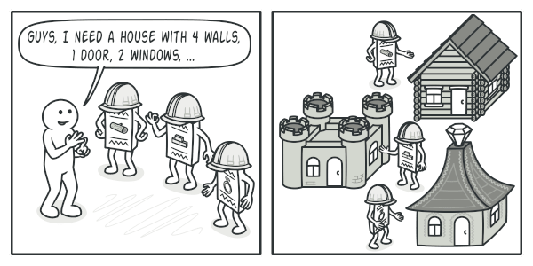

# Builder

#### **I. Giới thiệu**

**Builder** là một design pattern khởi tạo cho phép bạn xây dựng các object phức tạp theo từng bước. Pattern này cho phép bạn tạo ra các kiểu và cách biểu diễn khác nhau của một object bằng cách sử dụng cùng một mã xây dựng.

II. Vấn đề

Hãy tưởng tượng một đối tượng phức tạp đòi hỏi việc khởi tạo tốn nhiều công sức, từng bước của nhiều trường và đối tượng lồng nhau. Mã khởi tạo như vậy thường được chôn bên trong một hàm tạo khổng lồ với rất nhiều tham số. Hoặc thậm chí tệ hơn: rải rác khắp mã máy khách.

Ví dụ: hãy nghĩ về cách tạo một `House`đối tượng. Để xây một ngôi nhà đơn giản, bạn cần xây bốn bức tường và một tầng, lắp một cánh cửa, lắp một cặp cửa sổ và xây một mái nhà. Nhưng điều gì sẽ xảy ra nếu bạn muốn một ngôi nhà lớn hơn, sáng sủa hơn, có sân sau và những tiện ích khác (như hệ thống sưởi, hệ thống ống nước và hệ thống dây điện)?

Giải pháp đơn giản nhất là mở rộng `House`lớp cơ sở và tạo một tập hợp các lớp con để bao gồm tất cả các tổ hợp tham số. Nhưng cuối cùng bạn sẽ có được một số lượng đáng kể các lớp con. Bất kỳ tham số mới nào, chẳng hạn như kiểu mái hiên, sẽ yêu cầu phát triển hệ thống phân cấp này hơn nữa.

Có một cách tiếp cận khác không liên quan đến việc nhân giống các lớp con. Bạn có thể tạo một hàm tạo khổng lồ ngay trong `House`lớp cơ sở với tất cả các tham số có thể điều khiển đối tượng ngôi nhà. Trong khi cách tiếp cận này thực sự loại bỏ sự cần thiết của các lớp con, nó lại gây ra một vấn đề khác.

Trong hầu hết các trường hợp, hầu hết các tham số sẽ không được sử dụng, khiến cho lệnh gọi hàm tạo trở nên khá xấu . Ví dụ, chỉ một phần nhỏ số nhà có bể bơi, vì vậy các thông số liên quan đến bể bơi sẽ vô dụng đến chín trên mười lần.

III. Giải pháp

Mẫu Builder gợi ý rằng bạn trích xuất mã xây dựng đối tượng ra khỏi lớp của chính nó và di chuyển nó sang các đối tượng riêng biệt được gọi là *builders* .

Mẫu này tổ chức việc xây dựng đối tượng thành một tập hợp các bước ( `buildWalls`, `buildDoor`, v.v.). Để tạo một đối tượng, bạn thực hiện một loạt các bước này trên đối tượng trình tạo. Phần quan trọng là bạn không cần phải gọi tất cả các bước. Bạn chỉ có thể gọi những bước cần thiết để tạo ra một cấu hình cụ thể của một đối tượng.

Một số bước xây dựng có thể yêu cầu cách triển khai khác nhau khi bạn cần xây dựng các hình thức trình bày khác nhau của sản phẩm. Ví dụ, tường của cabin có thể được xây bằng gỗ nhưng tường của lâu đài phải được xây bằng đá.

Trong trường hợp này, bạn có thể tạo một số lớp trình xây dựng khác nhau triển khai cùng một bộ bước xây dựng nhưng theo cách khác. Sau đó, bạn có thể sử dụng các trình tạo này trong quá trình xây dựng (tức là một tập hợp lệnh gọi các bước xây dựng được sắp xếp) để tạo ra các loại đối tượng khác nhau.

Ví dụ: hãy tưởng tượng một người xây dựng xây dựng mọi thứ từ gỗ và thủy tinh, người thứ hai xây dựng mọi thứ bằng đá và sắt và người thứ ba sử dụng vàng và kim cương. Bằng cách gọi cùng một nhóm các bước, bạn sẽ có được một ngôi nhà thông thường từ người xây dựng đầu tiên, một lâu đài nhỏ từ người xây dựng thứ hai và một cung điện từ người xây dựng thứ ba. Tuy nhiên, điều này sẽ chỉ hoạt động nếu mã máy khách gọi các bước xây dựng có thể tương tác với các nhà xây dựng bằng giao diện chung.

**Director**

Bạn có thể đi xa hơn và trích xuất một loạt lệnh gọi đến các bước của trình tạo mà bạn sử dụng để xây dựng một sản phẩm thành một lớp riêng biệt gọi là giám đốc . Lớp giám đốc xác định thứ tự thực hiện các bước xây dựng, trong khi trình xây dựng cung cấp việc triển khai các bước đó.

Việc có một lớp đạo diễn trong chương trình của bạn là không thực sự cần thiết. Bạn luôn có thể gọi các bước xây dựng theo thứ tự cụ thể trực tiếp từ mã máy khách. Tuy nhiên, lớp giám đốc có thể là nơi thích hợp để đặt các quy trình xây dựng khác nhau để bạn có thể sử dụng lại chúng trong chương trình của mình.

Ngoài ra, lớp giám đốc hoàn toàn ẩn các chi tiết xây dựng sản phẩm khỏi mã máy khách. Khách hàng chỉ cần liên kết người xây dựng với giám đốc, khởi công xây dựng với giám đốc và nhận kết quả từ người xây dựng.

IV. Cấu trúc

1. Giao diện Builder khai báo các bước xây dựng sản phẩm chung cho tất cả các loại trình xây dựng.

2. Concrete Builders cung cấp các cách triển khai khác nhau của các bước xây dựng. Những người xây dựng bê tông có thể tạo ra những sản phẩm không tuân theo giao diện chung.

3. Sản phẩm là đối tượng kết quả. Các sản phẩm được xây dựng bởi các nhà xây dựng khác nhau không nhất thiết phải thuộc cùng một hệ thống phân cấp hoặc giao diện lớp.

4. Lớp Director xác định thứ tự gọi các bước xây dựng để bạn có thể tạo và sử dụng lại các cấu hình cụ thể của sản phẩm.
5. Khách hàng phải liên kết một trong các đối tượng người xây dựng với giám đốc. Thông thường, nó chỉ được thực hiện một lần, thông qua các tham số của hàm tạo của giám đốc. Sau đó, giám đốc sử dụng đối tượng xây dựng đó cho tất cả các công việc xây dựng tiếp theo. Tuy nhiên, có một cách tiếp cận khác khi khách hàng chuyển đối tượng người xây dựng sang phương thức sản xuất của giám đốc. Trong trường hợp này, bạn có thể sử dụng một công cụ xây dựng khác mỗi khi bạn sản xuất thứ gì đó với đạo diễn.
